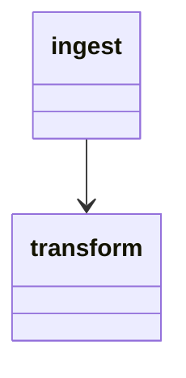

# Technical & Design

<Write a high level description of your pipeline including pipeline purpose and functions>

It was created using a [Databricks Asset Bundle](https://docs.databricks.com/en/dev-tools/bundles/index.html) which means the pipeline steps are defined as a yaml file: [tp_dp_ff_pipelines_job.yml](/resources/tp_dp_ff_pipelines_job.yml). The pipeline yaml file also describes the job cluster details used during the pipeline execution.

# Architecture Diagram:

# Components and Modules:
## Dependencies
All dependencies are defined in the [pyproject.toml](/pyproject.toml) file using [poetry](https://python-poetry.org/) for dependency management.
- pg_composite_pipelines_cdl: creating base client and interacting with Metadata API
- pg_composite_pipelines_configuration: reading and combining multipe config yaml files into one config dictionary
- pg-composite-pipelines-migration: Automating schema migration based on SQL DDL scripts
- For other packages including asyncio, nest_asyncio, etc, refers to pyproject.toml

## Configuration
Configuration is defined using [ps configuration package](https://github.com/procter-gamble/de-cf-ps-configuration). There are two config files, dev.yaml and prod.yaml providing all necessary configuration for respective environments. It's located here: [config folder](/bronze_<>/config)
including:
- general config: specifies ps tanent id and kv
- cdl metadata config: includes target API endpoints, application ids, and secrets info for access
- storage config: specifcies data sources details including account names, container names, and secret names
- schema and table specification: defines schema name, table names, and table metadata

## Data Source
- upstream contact
- downstream contact
- format
- classification
- partition
- etc

## Data Ingestion
<>

## Data Transfromation
<>

## Data Publication - <choose applicable ones>
* ddl/ - contains queries that define databricks object definitions and schema migrations
* migrate.py - provides schema migration functionality using [ps migration package](https://github.com/procter-gamble/de-cf-ps-migration). It runs queries defined in ddl/ directory to create/update databricks tables and views. The script is set to run in the CI/CD pipeline on each push to develop (run ddls on dev env) and main (run ddls on prod env) branches.

## Workflow
[pg_cp_tms_job.yml](/resources/pg_cp_tms_job.yml)
- A Databricks job responsible for publishing <> data to metadata. It runs <frenquency> starting from <time> and sends failure notifications to <email>.
- The main task, `publish_task`, executes data publishing for <tables>.
- The job uses a new cluster configuration with Spark version 13.3.x-scala2.12 and autoscaling from 1 to 4 workers.

