# File Watcher

## Pipeline Purpose & Overview

The **File Watcher** automates the monitoring and processing of files arriving in Azure Storage specifically at `IN` directory in `tp-source-data` container. Its main functions are:

- The file_watcher workflow is triggered automatically when a new .zip file arrives, using a file arrival event.
- Validates filename patterns and metadata against contract lookup tables in Postgres.
- Handles file routing across `WORK` and `REJECT` directories, inserting run metadata into control tables.
- Inserts metadata related to workflows based on job and contract assignment, file size, and override indicators.
- Ensures robust error handling and logging.

All pipeline steps and cluster configurations are managed via a Databricks Asset Bundle. For job orchestration and configuration, see [tp_dp_ff_pipelines_job.yml](/resources/tp_dp_ff_pipelines_job.yml).

---

# Architecture Diagram

```mermaid
graph TD
    IN["IN Directory"]
    WORK["WORK Directory"]
    REJECT["REJECT Directory"]

    Poll["Poll for .zip files in IN"]
    Validate["Validate filename pattern via Postgres"]
    InsertMeta["Insert run metadata"]
    MoveFile["Move file (IN→WORK/REJECT)"]

    RejMeta["Insert reject file metadata"]

    %% Storage group
    classDef storage fill:#fefefe,stroke:#333,stroke-width:2px;
    class IN,WORK,REJECT storage;

    %% FileWatcher group
    classDef watcher fill:#e3f2fd,stroke:#333,stroke-width:2px;
    class Poll,Validate,InsertMeta,MoveFile,RejMeta watcher;

    IN --> Poll
    Poll --> Validate
    Validate -->|valid| InsertMeta
    Validate -->|invalid| RejMeta
    InsertMeta --> MoveFile
    MoveFile --> WORK
    RejMeta --> REJECT
```

---

# Components and Modules

## Dependencies

Dependency management is handled via `pyproject.toml` (with Poetry). Key dependencies:

- `pyspark`: SparkSession for distributed data processing.
- `tp_utils.common`: Utility functions for logging, secret retrieval, and database interaction.
- `datetime`, `pytz`: Timezone-aware timestamping.
- `requests`, `os`: Service integration and file manipulations.

Databricks secrets are used to securely access database credentials and configuration.

## Configuration

Secrets and configuration are loaded via Databricks KeyVault integration (see `get_dbutils`). Input, working, and rejection base paths are dynamically derived using the Spark session and environment.

Important config and secret entries:
- Ref DB JDBC URL
- Schema & table names (`mm_run_plc`, `mm_rejct_file_plc`, `mm_wkf_lkp`)
- Postgres hostname, user, password

Additional configuration for downstream workflow job triggering is specified in [tp_dp_ff_pipelines_job.yml](https://github.com/procter-gamble/da-dp-pda-fftp01-databricks/blob/c4083b76b927766fc5b96760d9744412df25d117/resources/tp_dp_ff_pipelines_job.yml).

---

# Data Flow

## 1. File Monitoring & Ingestion

- **Polling Logic:** The pipeline continually checks the IN directory for incoming `.zip` files, sorting them by arrival time (FIFO).
- **Pattern Validation:** For each `.zip` file, a query matches the filename against entries in `mm_cntrt_lkp` (contract lookup). Only exact matches are valid for further processing.
- **Rejection Handling:** Files that do not match any pattern or have ambiguous matches are:
  - Inserted into the rejects control table (`mm_rejct_file_plc`)
  - Moved to the REJECT directory.
- **Accepted Files:** Valid files trigger extraction of key metadata (contract/job IDs, override flag) for run metadata recording.

## 2. Metadata Insertion, File Routing & Renaming

- Metadata for each valid run is inserted using the `write_to_postgres` function into `mm_run_plc`.
- Each file is renamed to include its contract/job/run IDs and current timestamp for traceability.
- The pipeline updates the filename in the control table and moves the file to the WORK directory.

## 3. Dynamic Cluster Assignment

- Override indicator and file size determine the cluster size:
  - `<1GB`: Small, `<3GB`: Medium, otherwise Large.
- The pipeline retrieves job IDs for the appropriate cluster/application from the lookup table.
- Job orchestration logic maps files to downstream tasks as defined in the workflow YAML.

---

## Workflow Details

### Workflow Job: **File_Watcher**

- **Name:** `File_Watcher`
- **Timeout:** 1800 seconds (30 minutes)
- **Maximum Concurrent Runs:** 1
- **Health Rules:**  
  - If job duration > 1500 seconds, issue warning.
- **Trigger:**  
  - **File Arrival:** Watches the directory at `${var.file_arrival_path}`.  
  - No minimum time between triggers; triggers instantly on change.
- **Tasks:**  
  - Runs `file_watcher.py` as a Spark Python task.
  - Libraries: `openpyxl`, `xlsxwriter`, `pathvalidate` (PyPI).
- **Cluster Configuration:**  
  - Spark Version: `16.4.x-scala2.12`
  - Node Type: `Standard_D4ds_v5` on Azure (SPOT with fallback, elastic disk enabled)
  - Environment variables:
    - Secure secrets for integration (MDM, JFROG, SKID, etc.).
    - Databricks Python (PYSPARK_PYTHON=/databricks/python3/bin/python3)
  - Policy: `${var.cluster_policy_id}`
  - Worker autoscale: 1 to 4 workers.
  - Data Security Mode: USER_ISOLATION
  - Cluster logs destination: `dbfs:/flexflow-default-cluster-logs/`
  - Not single-node, Standard engine, Classic preview kind.
- **Queue:** Disabled (No queued runs; runs trigger immediately)
- **Email Notifications:**  
  - Supports on_failure and on_duration_warning_threshold_exceeded to emails.

# Error Handling & Logging

- All exceptions and errors during loop/file handling are logged.
- On error, affected files are moved or marked explicitly.
- Final log message indicates completion or exhaustion of files.

---

# References

- [`file_watcher.py`](https://github.com/procter-gamble/da-dp-pda-fftp01-databricks/blob/c4083b76b927766fc5b96760d9744412df25d117/tp_dp_ff_pipelines/notebooks/src/file_watcher.py)
- [`tp_dp_ff_pipelines_job.yml`](https://github.com/procter-gamble/da-dp-pda-fftp01-databricks/blob/c4083b76b927766fc5b96760d9744412df25d117/resources/tp_dp_ff_pipelines_job.yml)
- [Databricks Asset Bundles](https://docs.databricks.com/en/dev-tools/bundles/index.html)
- [Poetry Dependency Management](https://python-poetry.org/)