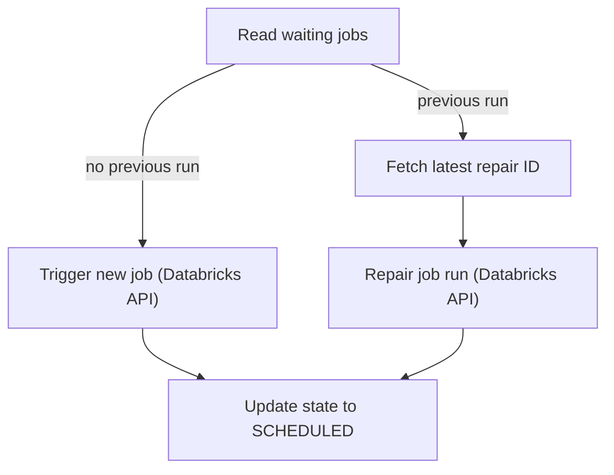

# Process Manager 

## Pipeline Purpose & Overview

The **Process Manager** orchestrates state transitions and execution for jobs in RUN_WAITING state (as listed in Postgres control view `mm_run_wait_vw`). Key responsibilities:

- Reads waiting jobs from Postgres.
- Triggers new jobs via Databricks API when no previous run exists.
- Schedules jobs as "SCHEDULED" after triggering.
- For jobs with previous runs, fetches the latest repair ID and triggers a repair run via API.
- Updates job status in Postgres post-trigger or post-repair.
- Uses a retry decorator for robust API error handling.

Orchestration and cluster resources are managed via Databricks secrets and [tp_dp_ff_pipelines_job.yml](/resources/tp_dp_ff_pipelines_job.yml).

---

## Architecture Diagram

---

## Components and Modules

### Dependencies

- `pyspark`: SparkSession
- `tp_utils.common`: DB/Secret utility
- `requests`: REST API operations
- `time`, `functools`: Implements retry decorator and exponential backoff

### Configuration

- DB and Databricks instance/token via KeyVault.
- Postgres schema/table info, JDBC, API base URL.

---

## Data Flow

1. **Read Waiting Jobs**
    - Loads records from Postgres `mm_run_wait_vw` view.
    - Loops through jobs with state='WAITING'.

2. **Trigger or Repair**
    - If no previous run, triggers new Databricks job via REST API and sets state to SCHEDULED.
    - If previous run exists, fetches repair history, calls repair with latest repair ID, updates state to SCHEDULED.

3. **API Interaction**
    - Auth via bearer token.
    - Handles all job/repair actions as API POST calls.
    - Retry logic protects from transient errors.

4. **Status Update**
    - After job/repair, sets job control status in Postgres.

### Error Handling & Logging

- Retry decorator (exponential backoff) for API calls.
- Logs success, errors, and fatal conditions for traceability.

---
## Workflow Details

### Workflow Job: **Process_Manager**

- **Name:** `Process_Manager`
- **Timeout:** 900 seconds (15 minutes)
- **Maximum Concurrent Runs:** 1
- **Tasks:**  
  - Runs `process_manager.py` as a Spark Python task.
  - Libraries: `openpyxl`, `xlsxwriter`, `pathvalidate` (PyPI).
- **Cluster Configuration:**  
  - Spark Version: `16.4.x-scala2.12`
  - Node Type: `Standard_D4ds_v5` on Azure (SPOT with fallback, elastic disk enabled)
  - Environment variables:
    - Secure secrets for integration (MDM, JFROG, SKID, etc.).
    - Databricks Python (PYSPARK_PYTHON=/databricks/python3/bin/python3)
  - Policy: `${var.cluster_policy_id}`
  - Worker autoscale: 1 to 4 workers.
  - Data Security Mode: USER_ISOLATION
  - Cluster logs destination: `dbfs:/flexflow-default-cluster-logs/`
  - Not single-node, Standard engine, Classic preview kind.
- **Queue:** Disabled (No queued runs; runs trigger immediately)
- **Email Notifications:**  
  - Supports on_failure to emails.
---
## References

- [`process_manager.py`](https://github.com/procter-gamble/da-dp-pda-fftp01-databricks/blob/c4083b76b927766fc5b96760d9744412df25d117/tp_dp_ff_pipelines/notebooks/src/process_manager.py)
- [`tp_dp_ff_pipelines_job.yml`](https://github.com/procter-gamble/da-dp-pda-fftp01-databricks/blob/c4083b76b927766fc5b96760d9744412df25d117/resources/tp_dp_ff_pipelines_job.yml)
- [Databricks Asset Bundles](https://docs.databricks.com/en/dev-tools/bundles/index.html)
- [Poetry Dependency Management](https://python-poetry.org/)